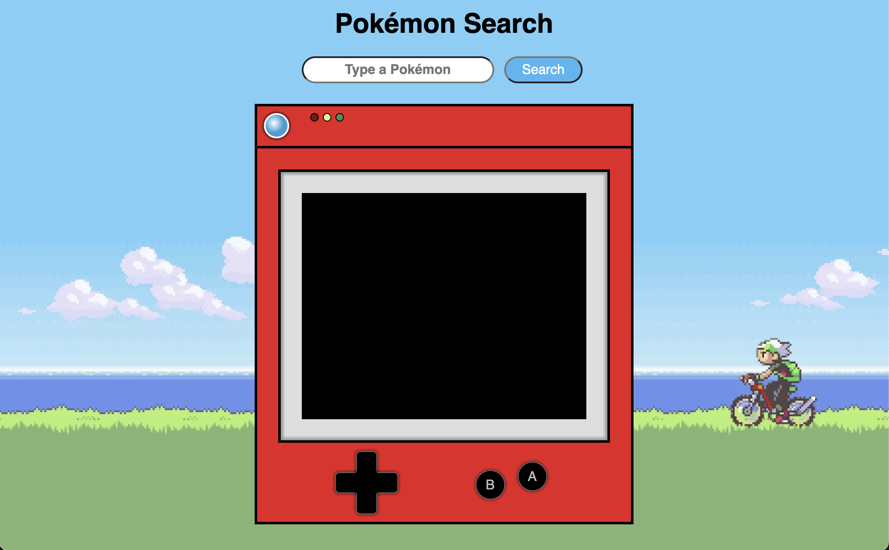

<h1 align="center">Projects</h1>
<table bordercolor="#66b2b2">
    <tr>
    <td width="50%" valign="top">
      <h3 align="center">Pokédex</h3>
         
        
         
        

          
    
  
      

        
<strong>HTML, CSS, Javascript</strong> - Look up stats about any Pokemon!

    </td>
        <td width="50%" valign="top">
      <h3 align="center"></h3>
         
        
         
        

          
    
  
      

        
<strong></strong> - 

    </td>
    </tr>
     <tr>
    <td width="50%" valign="top">
      <h3 align="center"></h3>
         
        
         
        

          
    
  
      

        
<strong></strong> - 

    </td>
        <td width="50%" valign="top">
      <h3 align="center"></h3>
         
        
         
        

          
    
  
      

        
<strong></strong> - 

    </td>
    </tr>
</table>

<h1 align="center">Technologies</h1>

    
    
    
    
    
    
    
    
    
    
    

<h1 align="center">Connect</h1>

  
  
  
  
  

