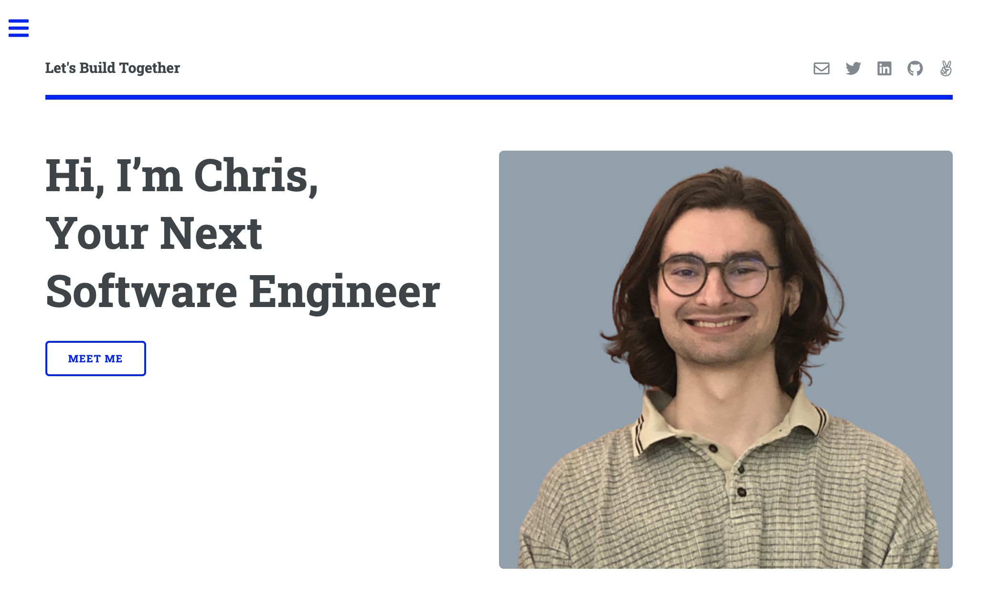
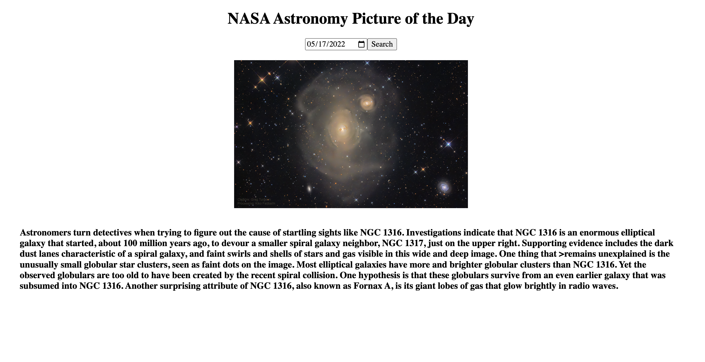

<h1 align="center">About Me</h1>

I am a passionate problem solver and I’m constantly thinking about ways that I can learn and improve my code. I can be cooking, hiking, or playing tennis and I will think of a new project idea or solution to a coding problem. I’m determined to find answers, solve problems, and build projects. 

 

 Feel free to reach out and connect!

  
  
  
  

<h1 align="center">Projects</h1>
<table bordercolor="#66b2b2">
    <tr>
    <td width="50%" valign="top">
      <h3 align="center">Pokédex</h3>
         
        
         
        

          
    
  
      

        
<strong>HTML5, CSS3, Javascript </strong> - Look up stats about any Pokemon!

    </td>
        <td width="50%" valign="top">
      <h3 align="center">ChrisMoss.com</h3>
         
        
         
        

          
    
  
      

        
<strong>HTML5, CSS3, & Javascript</strong> -Find projects and ways to get in touch with me. 

    </td>
    </tr>
     <tr>
    <td width="50%" valign="top">
      <h3 align="center">Tic-Tac-Toe</h3>
         
        
         
        

          
    
  
      

        
<strong>HTML5, CSS3, Javascript & React</strong> -Play the classic game of tik-tak-toe with a friend! 

    </td>
        <td width="50%" valign="top">
      <h3 align="center">NASA Photo of the Day</h3>
         
        
         
        

          
    
  
      

        
<strong>HTML5, CSS3, & Javascript</strong> -Choose a date to view the NASA photo of the day and a description sourced from the NASA API portal 

    </td>
    </tr>
</table>

<h1 align="center">Technologies</h1>

    
    
    
    
    
    
    
    
    
    
    

